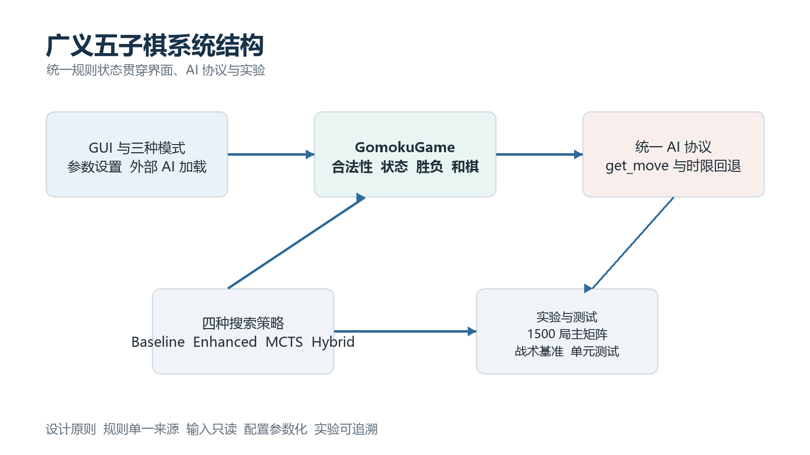
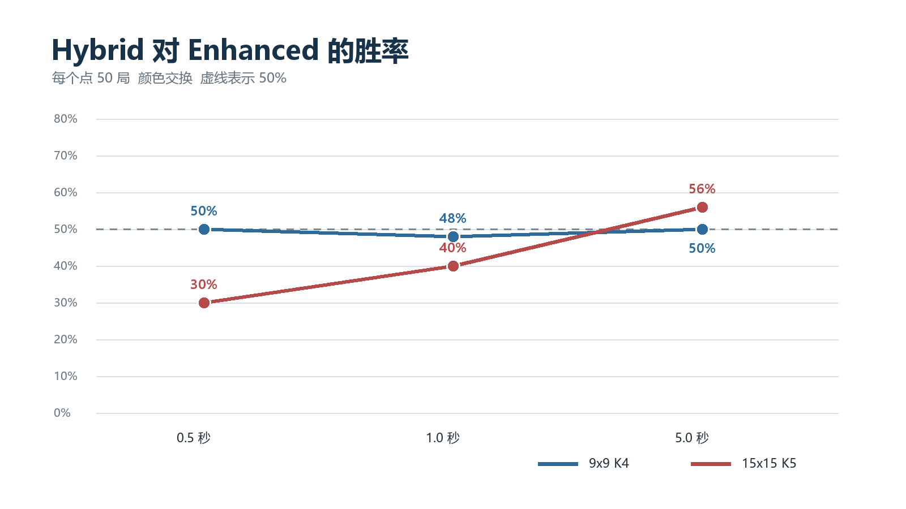
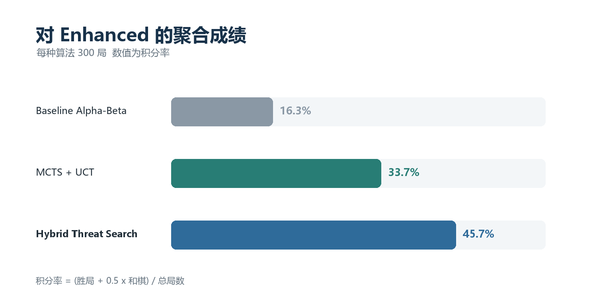

# 广义五子棋与对抗搜索项目报告

> BME1322.01 人工智能 Assignment 1

## 摘要

本项目实现了一个参数化的广义五子棋系统。棋盘边长 `N` 与获胜连珠数 `K` 均由运行时配置，游戏支持人人、人机和机机三种模式，并可加载符合课程统一协议的外部 AI。最终提交入口 `GomokuAI` 采用 Hybrid Threat Search：它在迭代加深 Alpha-Beta 的基础上加入参数化威胁评估、置换表、强制威胁证明、静态搜索和选择性剪枝，同时始终保留合法着法作为超时回退。

实验覆盖 `(N,K)=(9,4)` 与 `(15,5)`、每步 `0.5/1.0/5.0` 秒。当前源码对应的 1500 局主实验中，Hybrid 对 Random 的 300 局全部获胜；Hybrid 自我对战 300 局没有协议失败；与 Enhanced Alpha-Beta 的直接对比中，Hybrid 的聚合成绩为 `137-163-0`，明显优于 Baseline 的 `49-251-0` 和 MCTS 的 `98-196-6`。Hybrid 在 `15x15, K=5, 5.0s` 组以 `28-22` 战胜 Enhanced，但在更短时限下落后，说明威胁证明的收益依赖充足的计算预算。100 题基础战术测试和 36 题多步战术测试中，Hybrid 分别达到 `100/100` 和 `36/36`；主实验 1500 局未出现超时、异常、非法落子或输入棋盘修改。

## 1 总体设计

### 1.1 系统结构

系统把规则、界面、AI 和实验分离。`GomokuGame` 是唯一的棋局状态管理者，负责配置校验、落子合法性、轮换玩家、四方向连珠判定与和棋判定。GUI 只通过该接口更新棋局；AI 接收棋盘副本，不直接修改真实状态。实验程序复用相同的协议与合法性检查，因此界面试玩、课程裁判和批量实验使用的是同一套行为约束。



| 模块                      | 主要职责                                               |
| ----------------------- | -------------------------------------------------- |
| `main.py`               | 启动 Tkinter 图形界面                                    |
| `gomoku_game.py`        | 保存棋盘状态，校验落子，判定胜负与和棋                                |
| `gui.py`                | 实现三种模式、参数设置、棋盘绘制、外部 AI 加载与异步调用                     |
| `gomoku_ai.py`          | 实现 Baseline、Enhanced、MCTS、Hybrid 及课程提交类 `GomokuAI` |
| `final_experiments.py`  | 生成主实验矩阵，记录逐局结果并汇总                                  |
| `tests/` 与 benchmark 脚本 | 验证规则、协议、战术正确性、搜索效率和实验完整性                           |

### 1.2 三种对战模式

- 人人对战：两名玩家在同一 GUI 中交替点击空位，`GomokuGame` 在每步后判定胜负。
- 人机对战：用户选择执黑或执白；轮到 AI 时，GUI 在线程中调用统一的 `get_move`，主线程持续响应界面事件。
- 机机对战：黑白双方可独立选择四种内置策略或外部 `gomoku_ai.py`，程序自动推进，并记录每步坐标与耗时。

GUI 直接提供 `N`、`K`、每步时限和机机步间隔设置。配置必须满足 `N >= 3` 与 `3 <= K <= N`。规则引擎和所有 AI 都从构造参数读取 `N`、`K`。胜负检测沿横、竖和两条对角线同时向两侧计数，长度达到或超过 `K` 即判胜，因此长连也能正确处理。

### 1.3 协议与时限安全

课程入口保持为：

```python
GomokuAI(player_id, board_size, win_length)
get_move(board, last_opponent_move, time_limit) -> (row, col)
```

每次调用首先验证棋盘尺寸并选出合法保底着法：优先中心，其次对手上一手附近，最后扫描任意空位。搜索在棋盘副本上进行。软截止时间预留 `15%` 预算，并在候选生成、局面扫描、递归搜索、威胁证明和 MCTS 循环中重复检查。任何未完成的迭代都被丢弃，函数返回最近一次完整迭代的最佳着法；若搜索尚未完成一层，则返回保底着法。

## 2 AI 算法

### 2.1 参数化局面表示与候选生成

高级策略共享一次长度为 `K` 的窗口扫描。对横、竖和两条对角线上的每个窗口，程序统计双方棋子、空位和两端开放程度，并生成：

- 立即胜点，即窗口中已有 `K-1` 子且只有一个空位；
- 强制威胁，即落子后产生一个后续胜点；
- 双威胁，即落子后产生两个及以上不同胜点；
- 普通进度分与中心距离，用于安静局面的排序与评估。

多个窗口指向同一完成点时只计一个胜点，含有对方棋子的窗口不计入本方进度。非终局权重随已占棋子数 `i` 和 `K` 自适应增长：

```text
w(i,K) = min(C, round(10 ** (1 + 7i/K)))
Eval(s,p) = Tactical(s,p) - Tactical(s,opponent)
          + clip(Positional(s,p) - Positional(s,opponent))
```

其中 `Tactical` 对立即胜点、双威胁和单一强制威胁分层赋值，所有非终局分数均限制在胜负分以下。由于判断依据是 `K` 窗口中的棋子数和不同完成点数量，同一实现可用于 `(5,3)`、`(7,4)`、`(9,5)`、`(11,6)` 和 `(15,7)` 等配置。

候选着法只取已有棋子一至两格邻域内的空位。排序依次考虑己方立即胜、唯一强制防守、己方双威胁、对方双威胁、单威胁、历史启发和中心性。这样把搜索集中在局部战术区域，同时保留所有必须应对的着法。

### 2.2 Baseline 与 Enhanced Alpha Beta

Baseline 采用固定浅层 Negamax 与 Alpha-Beta 剪枝，候选半径为一格，评估函数按连续段长度和开放端数量计分。它保留最基本的课堂框架，作为高级方法的对照。

Enhanced 使用迭代加深、两格邻域候选、威胁排序和动态分支上限。置换表键为 `(Zobrist hash, player)`，条目保存搜索深度、`exact/lower/upper` 边界、分数与最佳着法。浅层条目仅用于着法排序，只有深度足够时才参与剪枝；接近胜负分的值按当前 ply 归一化，避免同一杀棋在不同深度被错误比较。

### 2.3 Hybrid Threat Search

最终策略先用受限的 VCF/VCT 风格威胁搜索寻找可证明的强制胜，再回退到增强 Alpha-Beta。威胁搜索只扩展攻击方的强制着法和防守方的必要应手，并返回 `PROVEN`、`DISPROVEN` 或 `UNKNOWN`。单一胜点不等于已经证明胜利，算法必须模拟对手在该点阻挡；只有两个不同胜点同时存在时才能直接证明。超时或节点上限产生 `UNKNOWN`，该结果不会缓存为失败。

常规搜索进一步使用 PVS、Aspiration Window、killer/history 排序、受保护的 LMR 和 Quiescence Search。LMR 只缩减靠后的低威胁着法；若缩减搜索得到改进，再按完整深度重搜。叶节点若仍存在立即胜负或强制应手，则进入静态搜索，而不是直接使用不稳定的静态分数。

```text
function GET_MOVE(board, time_limit):
    fallback <- choose_legal_fallback(board)
    deadline <- reserve_safety_margin(time_limit)
    if immediate_win_or_unique_block exists:
        return that move

    forced <- bounded_threat_proof(board)
    if forced is PROVEN:
        return forced.move

    best <- fallback
    for depth <- 1 to depth_limit:
        if near deadline: break
        result <- PVS_ALPHA_BETA(board, depth,
                                 transposition_table,
                                 quiescence_search)
        if iteration completed:
            best <- result.move
    return best
```

### 2.4 MCTS 与最终策略选择

MCTS 使用 UCT 选择，强制着法优先扩展，普通候选随父节点访问次数渐进开放。Rollout 依次检查立即胜、立即阻挡、己方双威胁和对方双威胁；达到截断条件时以同一参数化评估函数估值。

最终提交选择 Hybrid，而不是简单采用小规模对战积分最高的 Enhanced。选择顺序先检查协议与基础战术，再比较多步战术正确率，随后才参考配对对战积分、完成深度和 P95 耗时。Hybrid 在 36 题多步基准中为 `36/36`，Enhanced 为 `35/36`，MCTS 为 `170/180` 次，因此 Hybrid 在进入对战积分比较前已经领先。这一规则优先保证确定性战术正确性和协议稳定性。

## 3 实验设计

### 3.1 主实验矩阵

主实验由 `final_experiments.py` 生成，共 30 组、1500 局。所有结果绑定当前 `gomoku_ai.py` 的 SHA-256 `fdd5be0d43fe1a34e10411821e8bd4c6cec9a67744fe0f97a3cec2133b618b82`。

| 实验 | 配置 | 时限 | 每组局数 | 合计 |
| --- | --- | --- | ---: | ---: |
| Hybrid 对 Random | `9x9 K4`、`15x15 K5` | `0.5/1.0/5.0s` | 50 | 300 |
| Hybrid 自我对战 | `9x9 K4`、`15x15 K5` | `0.5/1.0/5.0s` | 50 | 300 |
| Baseline 对 Enhanced | `9x9 K4`、`15x15 K5` | `0.5/1.0/5.0s` | 50 | 300 |
| MCTS 对 Enhanced | `9x9 K4`、`15x15 K5` | `0.5/1.0/5.0s` | 50 | 300 |
| Hybrid 对 Enhanced | `9x9 K4`、`15x15 K5` | `0.5/1.0/5.0s` | 50 | 300 |

对 Random 的比赛从空棋盘开始，Hybrid 执黑和执白各 25 局。AI 对 AI 的比赛使用 25 个合法、未终局的四 ply 中央区域开局，每个开局运行两次并交换双方颜色，以控制开局和先手偏差。每局记录胜负、原因、总手数、逐步耗时、搜索统计、随机种子、开局编号、源码哈希和协议错误。结果逐局 `flush + fsync`，manifest 与源码不匹配时拒绝续跑。

除主实验外，项目还保留 100 题基础战术、36 题多步战术、6 个局面的搜索效率测试、96 局先导对战和 2400 局全策略补充矩阵。补充数据用于交叉检查，不与主实验混合统计。

## 4 实验结果

### 4.1 Hybrid 对 Random

| 配置 | 时限 | W L D | 胜率 | 平均手数 | 每步平均秒 | P95 秒 |
| --- | ---: | ---: | ---: | ---: | ---: | ---: |
| `9x9 K4` | 0.5 | 50 0 0 | 100% | 7.7 | 0.221 | 0.430 |
| `9x9 K4` | 1.0 | 50 0 0 | 100% | 7.6 | 0.444 | 0.857 |
| `9x9 K4` | 5.0 | 50 0 0 | 100% | 8.0 | 2.592 | 4.758 |
| `15x15 K5` | 0.5 | 50 0 0 | 100% | 10.7 | 0.278 | 0.429 |
| `15x15 K5` | 1.0 | 50 0 0 | 100% | 9.9 | 0.532 | 0.856 |
| `15x15 K5` | 5.0 | 50 0 0 | 100% | 11.6 | 3.188 | 4.758 |

Hybrid 在全部 300 局中获胜，满足作业要求的 20 局以上测试，并覆盖两个 `(N,K)` 配置。高级搜索在安静局面通常会使用接近软截止时间的预算，因此平均耗时随时限增长。Random 基线过弱，100% 胜率主要证明协议、基础战术和时限管理可靠，不能单独用于比较高级策略的棋力。

### 4.2 Hybrid 自我对战

| 配置 | 时限 | A 的 W L D | B 的 W L D | 黑胜 白胜 和棋 | 平均手数 |
| --- | ---: | ---: | ---: | ---: | ---: |
| `9x9 K4` | 0.5 | 25 25 0 | 25 25 0 | 44 6 0 | 10.2 |
| `9x9 K4` | 1.0 | 26 24 0 | 24 26 0 | 43 7 0 | 10.3 |
| `9x9 K4` | 5.0 | 25 25 0 | 25 25 0 | 46 4 0 | 10.0 |
| `15x15 K5` | 0.5 | 25 25 0 | 25 25 0 | 28 22 0 | 25.0 |
| `15x15 K5` | 1.0 | 25 25 0 | 25 25 0 | 32 18 0 | 28.3 |
| `15x15 K5` | 5.0 | 25 25 0 | 25 25 0 | 38 12 0 | 23.4 |

交换颜色后，两个相同算法实例的成绩接近平衡；颜色统计仍显示黑方优势，尤其在 `9x9 K4` 上更明显。这说明颜色交换能够平衡 A/B 身份，却不能消除规则本身的先手优势。大棋盘平均局长为 23.4 至 28.3 手，明显高于小棋盘的约 10 手，符合更大状态空间和更长成线要求的预期。

### 4.3 不同算法与时限



| 对手策略                |  聚合 W L D |    胜率 |   积分率 |
| ------------------- | --------: | ----: | ----: |
| Baseline 对 Enhanced |  49 251 0 | 16.3% | 16.3% |
| MCTS 对 Enhanced     |  98 196 6 | 32.7% | 33.7% |
| Hybrid 对 Enhanced   | 137 163 0 | 45.7% | 45.7% |



Hybrid 在 `9x9 K4` 三档时限下分别取得 `50%`、`48%` 和 `50%` 胜率，与 Enhanced 基本持平。在 `15x15 K5` 上，胜率随时限从 `30%`、`40%` 提升到 `56%`。这组结果说明威胁证明、静态搜索和更复杂的着法排序存在固定开销；预算不足时 Enhanced 的常规 Alpha-Beta 更有效，预算达到 5 秒后 Hybrid 才把更深的战术分析转化为胜率。

MCTS 在 `15x15 K5` 的 5 秒组仅为 `5-44-1`。更多时间没有稳定改善其表现，原因是较长 rollout 和较大的候选空间增加了方差，而确定性的强制威胁在有限预算下更适合由 Alpha-Beta 类搜索处理。

### 4.4 战术正确性与工程可靠性

| 验证 | Enhanced | Hybrid | MCTS |
| --- | ---: | ---: | ---: |
| 100 题一步攻防 | 100 100 | 100 100 | 500 500 |
| 36 题多步与伪威胁 | 35 36 | 36 36 | 170 180 |

MCTS 对每题使用 5 个固定随机种子，因此两项测试的尝试次数分别为 500 和 180。Hybrid 唯一达到多步题全对，尤其避免把“只有一个完成点”误判为不可防守的双威胁。

主实验 1500 局与补充矩阵 2400 局均完整结束，`timeout`、`exception`、`illegal_move` 和 `input-board modification` 均为 0。本次报告生成前重新运行了 38 项单元测试，全部通过。测试覆盖不同 `N/K` 的胜负与和棋、长连、两种斜线、协议直接加载、严格时限、输入只读、置换表边界、Zobrist 哈希、威胁三态和实验矩阵完整性。

### 4.5 四种 AI 对 Random 的补充实验

2400 局补充矩阵中的前 1200 局用于比较四种 AI 对 Random 的表现。每种 AI 均覆盖两组配置和三档时限，每组 50 局，其中 AI 执黑、执白各 25 局。该矩阵与 1500 局主实验独立运行；下表中的 Hybrid 数据不与 4.1 节合并。

| AI | 配置 | 时限 | W L D | 每步平均秒 | P95 秒 | 平均手数 |
| --- | --- | ---: | ---: | ---: | ---: | ---: |
| Baseline | `9x9 K4` | 0.5 | 50 0 0 | 0.0014 | 0.0030 | 8.58 |
| Baseline | `9x9 K4` | 1.0 | 50 0 0 | 0.0015 | 0.0034 | 8.78 |
| Baseline | `9x9 K4` | 5.0 | 50 0 0 | 0.0041 | 0.0128 | 8.22 |
| Baseline | `15x15 K5` | 0.5 | 50 0 0 | 0.0029 | 0.0059 | 15.58 |
| Baseline | `15x15 K5` | 1.0 | 50 0 0 | 0.0031 | 0.0063 | 16.38 |
| Baseline | `15x15 K5` | 5.0 | 50 0 0 | 0.0063 | 0.0150 | 15.94 |
| Enhanced | `9x9 K4` | 0.5 | 50 0 0 | 0.2239 | 0.4284 | 7.78 |
| Enhanced | `9x9 K4` | 1.0 | 50 0 0 | 0.4416 | 0.8535 | 7.78 |
| Enhanced | `9x9 K4` | 5.0 | 50 0 0 | 2.4948 | 4.7575 | 7.74 |
| Enhanced | `15x15 K5` | 0.5 | 50 0 0 | 0.2671 | 0.4277 | 10.10 |
| Enhanced | `15x15 K5` | 1.0 | 50 0 0 | 0.5406 | 0.8548 | 10.14 |
| Enhanced | `15x15 K5` | 5.0 | 50 0 0 | 2.9461 | 4.7637 | 9.98 |
| MCTS | `9x9 K4` | 0.5 | 50 0 0 | 0.2273 | 0.4288 | 7.66 |
| MCTS | `9x9 K4` | 1.0 | 50 0 0 | 0.4438 | 0.8539 | 7.74 |
| MCTS | `9x9 K4` | 5.0 | 50 0 0 | 2.4502 | 4.7575 | 7.58 |
| MCTS | `15x15 K5` | 0.5 | 50 0 0 | 0.2752 | 0.4279 | 10.10 |
| MCTS | `15x15 K5` | 1.0 | 50 0 0 | 0.5569 | 0.8566 | 10.34 |
| MCTS | `15x15 K5` | 5.0 | 50 0 0 | 2.9741 | 4.7649 | 10.14 |
| Hybrid | `9x9 K4` | 0.5 | 50 0 0 | 0.2199 | 0.4286 | 7.70 |
| Hybrid | `9x9 K4` | 1.0 | 50 0 0 | 0.4335 | 0.8534 | 7.62 |
| Hybrid | `9x9 K4` | 5.0 | 50 0 0 | 2.5409 | 4.7572 | 7.74 |
| Hybrid | `15x15 K5` | 0.5 | 50 0 0 | 0.2658 | 0.4275 | 10.02 |
| Hybrid | `15x15 K5` | 1.0 | 50 0 0 | 0.5315 | 0.8559 | 10.02 |
| Hybrid | `15x15 K5` | 5.0 | 50 0 0 | 3.1552 | 4.7643 | 11.34 |

四种 AI 合计取得 `1200-0-0`，说明 Random 的胜率指标已经完全饱和。即使是固定浅层搜索的 Baseline 也能稳定处理 Random 的局部失误，因此这组实验适合验证基本战术、协议和颜色兼容性，却无法区分高级算法的相对棋力。

耗时揭示了不同算法的资源使用方式。Baseline 找到浅层结果后立即返回，每步平均仅为 `0.0014-0.0063s`，几乎不受给定时限影响。Enhanced、MCTS 和 Hybrid 在没有立即战术解时会继续利用搜索预算，其 P95 分别接近三档软截止时间 `0.43s`、`0.85s` 和 `4.76s`。三种高级策略在 `9x9 K4` 上平均约 7.6 至 7.8 手结束，在 `15x15 K5` 上约 10 至 11 手结束，均短于 Baseline 的 15.6 至 16.4 手。这表明高级策略能更早构造胜势，但由于所有方法都全胜，局长差异不能直接解释为总体棋力排序。

增加时限没有继续改善对 Random 的胜率，并且 Hybrid 在 `15x15 K5, 5.0s` 下的平均局长反而由约 10 手升至 11.34 手。这种小幅非单调变化来自 Random 对手的随机落子以及高级搜索在不同局面选择的胜法，不应被解释为更多计算降低了棋力。

### 4.6 四种 AI 自我对战的补充实验

补充矩阵的另外 1200 局由四种 AI 分别进行自我对战。A、B 是同一算法的两个独立实例；每组使用 25 个四 ply 开局，每个开局运行两次并交换 A/B 颜色。平均手数包括预置的四步开局。

| AI | 配置 | 时限 | A 的 W L D | B 的 W L D | 黑胜 白胜 和棋 | 平均手数 |
| --- | --- | ---: | ---: | ---: | ---: | ---: |
| Baseline | `9x9 K4` | 0.5 | 25 25 0 | 25 25 0 | 40 10 0 | 11.04 |
| Baseline | `9x9 K4` | 1.0 | 25 25 0 | 25 25 0 | 40 10 0 | 11.04 |
| Baseline | `9x9 K4` | 5.0 | 25 25 0 | 25 25 0 | 40 10 0 | 11.04 |
| Baseline | `15x15 K5` | 0.5 | 25 25 0 | 25 25 0 | 34 16 0 | 32.76 |
| Baseline | `15x15 K5` | 1.0 | 25 25 0 | 25 25 0 | 34 16 0 | 32.76 |
| Baseline | `15x15 K5` | 5.0 | 25 25 0 | 25 25 0 | 34 16 0 | 32.76 |
| Enhanced | `9x9 K4` | 0.5 | 25 25 0 | 25 25 0 | 46 4 0 | 10.12 |
| Enhanced | `9x9 K4` | 1.0 | 25 25 0 | 25 25 0 | 44 6 0 | 9.92 |
| Enhanced | `9x9 K4` | 5.0 | 25 25 0 | 25 25 0 | 46 4 0 | 9.64 |
| Enhanced | `15x15 K5` | 0.5 | 25 25 0 | 25 25 0 | 34 16 0 | 36.00 |
| Enhanced | `15x15 K5` | 1.0 | 26 24 0 | 24 26 0 | 35 15 0 | 31.10 |
| Enhanced | `15x15 K5` | 5.0 | 25 24 1 | 24 25 1 | 31 18 1 | 39.68 |
| MCTS | `9x9 K4` | 0.5 | 24 26 0 | 26 24 0 | 43 7 0 | 10.86 |
| MCTS | `9x9 K4` | 1.0 | 24 26 0 | 26 24 0 | 45 5 0 | 11.90 |
| MCTS | `9x9 K4` | 5.0 | 27 23 0 | 23 27 0 | 42 8 0 | 10.56 |
| MCTS | `15x15 K5` | 0.5 | 20 15 15 | 15 20 15 | 24 11 15 | 98.22 |
| MCTS | `15x15 K5` | 1.0 | 21 21 8 | 21 21 8 | 28 14 8 | 67.36 |
| MCTS | `15x15 K5` | 5.0 | 25 21 4 | 21 25 4 | 26 20 4 | 51.60 |
| Hybrid | `9x9 K4` | 0.5 | 25 25 0 | 25 25 0 | 44 6 0 | 10.16 |
| Hybrid | `9x9 K4` | 1.0 | 25 25 0 | 25 25 0 | 44 6 0 | 10.16 |
| Hybrid | `9x9 K4` | 5.0 | 25 25 0 | 25 25 0 | 46 4 0 | 9.96 |
| Hybrid | `15x15 K5` | 0.5 | 26 24 0 | 24 26 0 | 27 23 0 | 24.30 |
| Hybrid | `15x15 K5` | 1.0 | 25 25 0 | 25 25 0 | 34 16 0 | 32.92 |
| Hybrid | `15x15 K5` | 5.0 | 25 25 0 | 25 25 0 | 38 12 0 | 23.40 |

成对交换颜色后，A/B 总成绩大体平衡，说明实验没有系统性偏向某个实例；小幅偏差来自随机策略状态或同一开局下的搜索差异。颜色结果则显示稳定的先手优势：`9x9 K4` 的黑胜数在 40 至 46 局之间，四种算法都远高于白胜数。`15x15 K5` 的先手优势相对较弱；MCTS 三组和 Enhanced 的 5 秒组出现和棋，但所有分组仍以黑胜居多。因此，自我对战的 A/B 胜率不能单独反映棋力，颜色分布和成对开局必须同时报告。

不同算法在大棋盘上的对局长度差异最明显。Baseline 的平均局长固定为 32.76 手，因为固定深度搜索没有利用额外时限；Enhanced 为 31.10 至 39.68 手。Hybrid 分别为 24.30、32.92 和 23.40 手，其中 0.5 秒和 5 秒组明显短于 Enhanced，说明强制威胁搜索在部分开局中能更快把战术优势转化为终局，但 1 秒组的 32.92 手也表明这种效果并不随预算单调变化。

MCTS 在 `15x15 K5` 上表现出不同的终局特征：三档时限分别产生 15、8、4 局和棋，平均局长从 98.22 手下降到 67.36 和 51.60 手。更多迭代减少了随机 rollout 的不确定性，使算法更早形成或识别有效进攻，但即使在 5 秒时限下，MCTS 的平均局长仍是 Hybrid 的两倍以上。相比之下，`9x9 K4` 的强制战术更短，四种算法均没有和棋，平均局长集中在 9.64 至 11.90 手。

综合两部分补充实验，2400 局最有价值的结论不是四种 AI 都能战胜 Random，而是不同搜索方法在资源使用和终局行为上的差异。Baseline 速度最快但搜索浅；Enhanced 的表现较稳定；MCTS 在大棋盘更容易进入长局和和棋；Hybrid 通常能更快结束大棋盘自我对战，但其优势仍依赖时限与具体开局。补充矩阵全部 2400 局均未发生超时、异常、非法落子或输入棋盘修改。

## 5 讨论与反思

### 5.1 主要困难

最困难的部分不是单纯增加搜索深度，而是让威胁定义对任意 `K` 都成立。传统五子棋中的“活三”“冲四”依赖固定棋型；本项目改为统计长度为 `K` 的窗口和不同完成点，使规则可以泛化。实现过程中还必须区分“一个强制应手”和“两个互不相同的胜点”，否则算法会把可防守局面误判为必胜。

第二个困难是进攻与防守之间的权衡。早期迭代中的局面评估和候选着排序更重视构造己方威胁，AI 因而会持续进攻，却低估对手正在形成的威胁。后续版本同时分析双方的完成点、双威胁和普通进度，并提高必要防守在候选着排序和局面评估中的优先级，因此明显改善了防守稳定性。这里需要区分硬性战术和风格参数：己方立即胜和对方唯一胜点必须由规则直接处理，不能交给权重取舍；而在没有强制着法的局面中，己方进攻收益与对方威胁惩罚的相对权重仍可人为调整。权重偏向进攻时，AI 更愿意争取主动，但可能忽略潜在反击；偏向防守时，失误较少，却可能过早让出先手。这个平衡还会随 `N`、`K`、时限和对手风格变化，因此很难仅凭直觉一次确定。

第三个困难是时限内的可靠退出。威胁证明、静态搜索和 MCTS 都可能在局部产生大量分支，因此每个阶段都必须有独立的时间检查和节点上限。Hybrid 将威胁证明限制在剩余预算的约 12%，最多 0.35 秒；证明失败后恢复主截止时间，保证常规搜索仍能完成至少一次有意义的迭代。

第四个困难是实验公平性。确定性算法从同一空棋盘出发会重复相同棋局，所以 AI 对 AI 实验使用成对开局并交换颜色；源码哈希、manifest 和唯一任务键防止断点续跑时混入不同版本的数据。

### 5.2 局限性

1. Random 太弱，补充实验中四种 AI 合计 1200 局全胜；该基线不能说明 Hybrid 优于其他高级策略。
2. 25 个固定四 ply 开局之间仍有关联，颜色交换只能控制角色差异，不能提供完全独立的样本。
3. 窗口评分可能重复计算重叠结构，权重来自人工设计，尚未通过学习或系统参数搜索校准。
4. 候选上限和 LMR 可能漏掉表面安静但关键的着法；三态威胁搜索中的 `UNKNOWN` 也表示部分长强制链无法在预算内证明。
5. GUI 使用线程调用外部 AI，能够判定超时但不能强制终止失控线程；进程级隔离更适合不受信任的外部程序。
6. 5 秒时限显著增加总实验时间。个别 MCTS 对局达到满盘 225 手，虽然每步合法且未超时，但整局运行时间接近 900 秒。

### 5.3 后续改进

后续工作应优先增加分层开局集和独立随机中局，报告置信区间，而不是继续扩大同一固定开局的重复次数。算法方面可以增量维护窗口摘要和 Zobrist 哈希，减少每个节点的重复扫描；再通过消融实验分别关闭威胁证明、Quiescence、LMR 和置换表，量化每项优化的独立贡献。若继续改进 MCTS，应采用更短且更有战术约束的 rollout、复用搜索树，并根据棋盘大小调整探索常数和渐进开放速度。

## 6 结论

本项目完成了广义五子棋的规则引擎、三种对战模式、统一 AI 协议和多种对抗搜索方法。最终 Hybrid 策略在五组 `N/K` 战术配置上保持参数化，在 3900 局正式与补充实验中没有协议失败，并在 36 题多步战术测试中全部正确。实验同时表明，更复杂的搜索并不在所有预算下都更强：Hybrid 在大棋盘短时限下落后 Enhanced，只有在 5 秒预算下取得 `28-22` 的优势。这个结果支持本项目的最终取舍，即优先保证协议与战术正确性，并用安全回退控制高级搜索的风险。

## 7 复现与数据

```powershell
# 启动 GUI
python assignment1/main.py

# 单元测试与战术测试
python -m unittest discover -s assignment1/tests -v
python assignment1/tactical_benchmark.py --time-limit 0.15
python assignment1/advanced_tactical_benchmark.py --time-limit 0.3

# 主实验与汇总
python assignment1/final_experiments.py --only all --resume
python assignment1/final_experiments.py --summarize

# 四种 AI 对 Random 及各自自我对战，共 2400 局
python assignment1/comprehensive_evaluation.py --only all --resume
python assignment1/comprehensive_evaluation.py --summarize

# 课程裁判验证
python assignment-1-code/arena.py assignment1/gomoku_ai.py assignment-1-code/random_ai.py --board 15 --win 5 --time 5 --games 2 --quiet
```

主实验原始数据、汇总和版本清单分别位于 [`experiments/final/results.jsonl`](experiments/final/results.jsonl)、[`experiments/final/summary.json`](experiments/final/summary.json) 和 [`experiments/final/manifest.json`](experiments/final/manifest.json)。补充矩阵位于 [`experiments/comprehensive_evaluation/`](experiments/comprehensive_evaluation/)。

## 参考资料

1. 课程讲义《广义五子棋游戏与对抗搜索 Assignment 1》，2026。
2. 课程提供的 `arena.py` 与 `random_ai.py`。

本项目未调用外部五子棋引擎、在线服务或预计算固定应答表。
